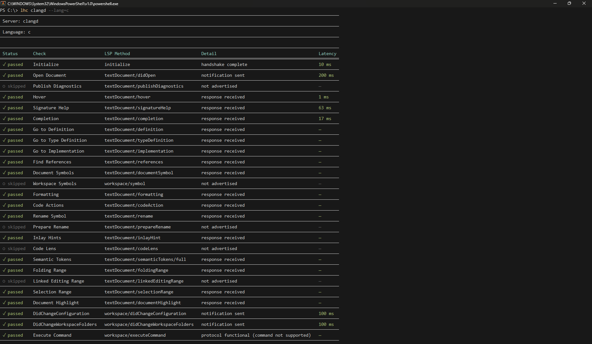

# LHC

LSP Server Health Checker Application, initially made in order to test <a href="https://github.com/axelang/axels">axels</a> for Axelang.

Example usage:

```shell
lhc clangd --lang=cpp
```

The above will show the performance  of the `clangd` server when used on C++ source files.

Below is an example with `clangd` and C:




Builtin languages (custom languages or DSLs are supported with the `--ref=<example-script.lang>` flag):

- Ada
- Axe
- Bash
- C
- Clojure
- CoffeeScript
- C++
- Crystal
- C#
- Cython
- D
- Dart
- Elixir
- Erlang
- Factor
- Fish
- Fortran
- F#
- GDScript
- Go
- Groovy
- Hare
- Haskell
- Haxe
- HolyC
- Java
- JavaScript
- Julia
- Kotlin
- Lisp
- Lua
- Mojo
- Nim
- Nu
- Oberon
- OCaml
- Perl
- PHP
- Pony
- PowerShell
- Prolog
- PureScript
- Python
- R
- Raku
- Rebol
- Red
- Ruby
- Rust
- Scala
- Scheme
- Shell
- Swift
- Terraform
- TypeScript
- Vala
- Wren
- Zig

___

### License

GPL-3.0-only
